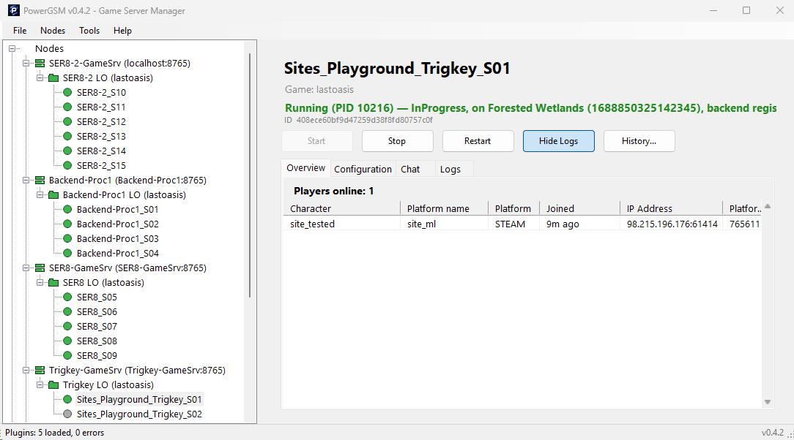
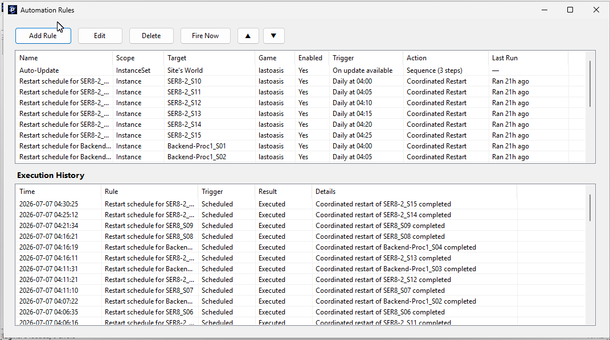
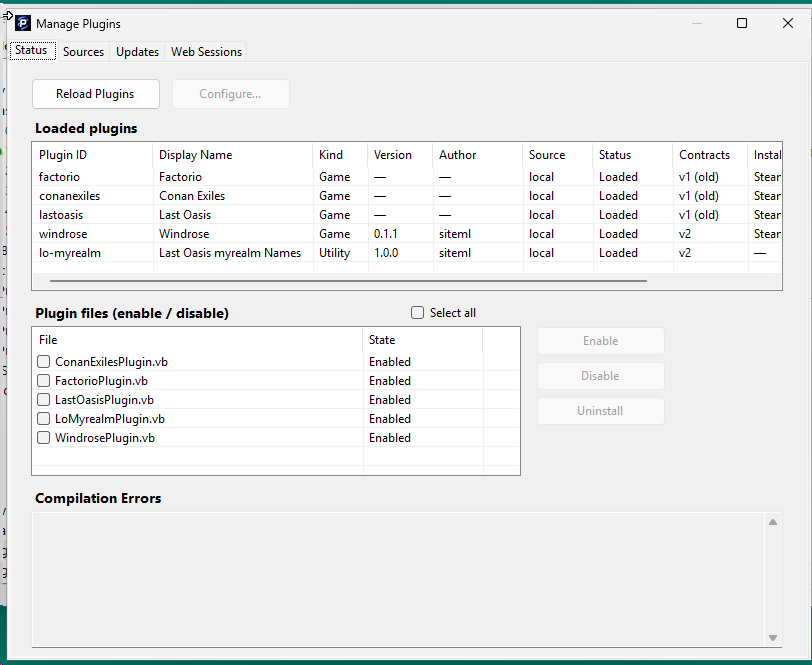
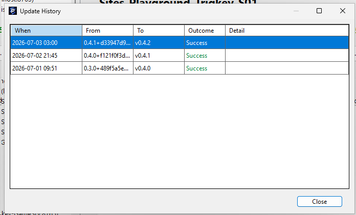
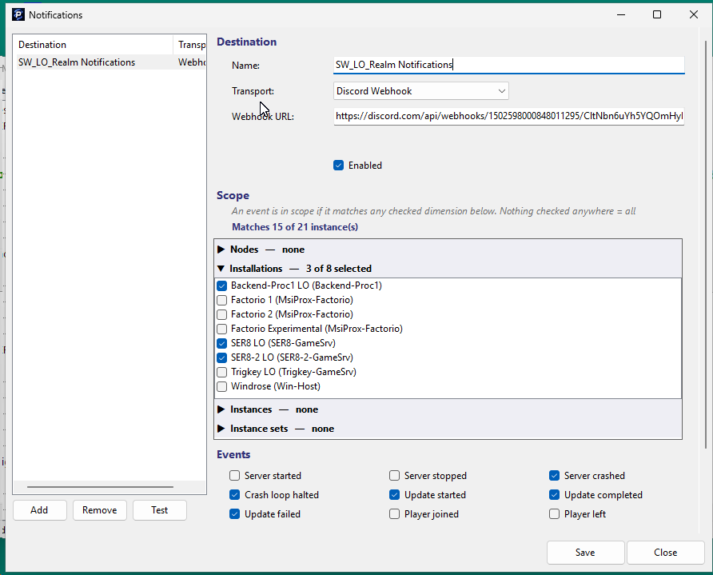
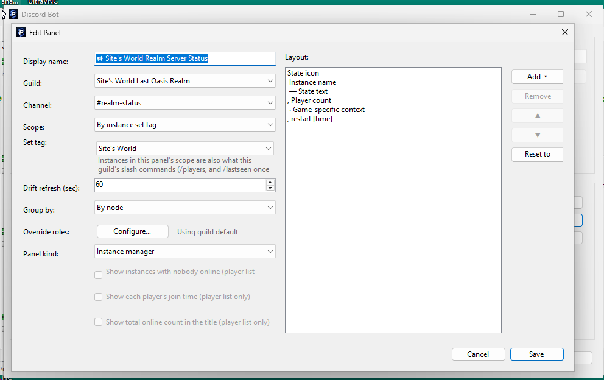

# PowerGSM

**A multi-node game server manager for Windows and Linux hosts.**

PowerGSM installs, launches, monitors, and updates dedicated game servers
across any number of machines from a single control application. Game
knowledge lives in hot-reloadable plugins, so support for new titles is
added without recompiling anything.

---

## What it is

PowerGSM is split into two cooperating programs:

- **Manager** — a Windows desktop application (WinForms, .NET 8). This is
  the thing you sit in front of. It holds the database, runs the plugins,
  drives automation and notifications, and talks to one or more Nodes over
  HTTP.
- **Node** — a small headless service (ASP.NET Core, .NET 8) that runs on
  each host machine. It actually starts the game processes, installs games
  via SteamCMD, tails logs, and reports player/server state back. It runs
  on **Windows or Linux**.

The guiding principle is **"Manager interprets, Node executes."** All game-
specific logic runs on the Manager side as plugins; the Node only ever
receives plain execution data (a command line, ports, log paths, regex
rules) and runs it. A Node never loads a plugin. This keeps Nodes simple,
identical across every host, and safe to update independently.

Supporting components (you rarely interact with these directly):

- **GSM.Shim** — a per-instance supervisor that owns the game process's
  I/O, so a Node can be restarted, updated, or crash without disturbing a
  running game.
- **GSM.NodeSetup** — a small utility for configuring a Node.
- **GSM.CtrlCSender** — a Windows helper for delivering clean shutdown
  signals.

```
                +-------------------+
                |     Manager       |   Windows desktop app
                |  (plugins, DB,    |   "interprets"
                |   automation)     |
                +---------+---------+
                          |  HTTP + auth token
          +---------------+----------------+
          |               |                |
   +------v-----+  +-------v------+  +------v------+
   |   Node A   |  |    Node B    |  |   Node C    |   Windows or Linux
   | (Windows)  |  |   (Linux)    |  |  (Windows)  |   "executes"
   +------+-----+  +------+-------+  +------+------+
          |               |                |
     game servers    game servers     game servers
```

---

## Screenshots

<table>
  <tr>
    <td align="center">
      <a href="https://raw.githubusercontent.com/siteml/PowerGSM/master/docs/screenshots/main-window.png"></a><br/>
      <sub>Main window</sub>
    </td>
    <td align="center">
      <a href="https://raw.githubusercontent.com/siteml/PowerGSM/master/docs/screenshots/automation-rules.png"></a><br/>
      <sub>Automation rules</sub>
    </td>
    <td align="center">
      <a href="https://raw.githubusercontent.com/siteml/PowerGSM/master/docs/screenshots/manage-plugins.png"></a><br/>
      <sub>Manage plugins</sub>
    </td>
    <td align="center">
      <a href="https://raw.githubusercontent.com/siteml/PowerGSM/master/docs/screenshots/update-history.png"></a><br/>
      <sub>Update history</sub>
    </td>
    <td align="center">
      <a href="https://raw.githubusercontent.com/siteml/PowerGSM/master/docs/screenshots/notifications.png"></a><br/>
      <sub>Notifications</sub>
    </td>
    <td align="center">
      <a href="https://raw.githubusercontent.com/siteml/PowerGSM/master/docs/screenshots/discord-edit-panel.png"></a><br/>
      <sub>Discord panel editor</sub>
    </td>
  </tr>
</table>

<sub>Click any thumbnail to view full size.</sub>

---

## Supported games

Official plugins ship for:

- **Last Oasis** (with optional myrealm portal enrichment)
- **Factorio**
- **Conan Exiles**
- **Windrose**

More can be added as plugins — see [writing plugins](docs/developer/plugin-authoring.md).

---

## Quick system requirements

Release builds are **self-contained** — they bundle their own .NET runtime,
so you do **not** need to install .NET to run PowerGSM. You only need the
.NET 8 SDK if you intend to build from source.

| Component | Requirement |
|---|---|
| **Manager** | Windows 10 / 11 or Windows Server (x64). No separate runtime install needed. |
| **Node** | Windows (x64) **or** Linux (x64, glibc — e.g. Ubuntu/Debian). No separate runtime install needed. |
| **Hosting Steam games** | SteamCMD (the Node uses it to install/update Steam-based servers). On Windows, Visual C++ redistributables — the Node installs these automatically from a game's bundled redist folder (needs Administrator). |
| **Network** | The Node listens on a TCP port (default **8765**). The Manager reaches each Node over HTTP with a shared auth token. Open that port between them. |

Full details, including per-game specifics and how to obtain SteamCMD, are
in [Prerequisites](docs/user/prerequisites.md).

---

## Download

Grab the latest release from the
[**Releases**](https://github.com/siteml/PowerGSM/releases) page. Each
release publishes three archives:

- `PowerGSM-Manager-X.Y.Z-win-x64.zip` — the Manager (Windows only)
- `PowerGSM-Node-X.Y.Z-win-x64.zip` — a Node for Windows hosts
- `PowerGSM-Node-X.Y.Z-linux-x64.zip` — a Node for Linux hosts

Install a Node on every host machine, and the Manager on your control PC.

---

## Getting started

1. [Check prerequisites](docs/user/prerequisites.md).
2. [Install and configure a Node](docs/user/node.md) on each host (Windows or Linux).
3. [Install the Manager](docs/user/manager.md), add your Node(s), and create your first game installation.
4. [Set up the plugin](docs/user/plugins.md) for the game you want to host.

---

## Documentation

### For operators (running servers)

- [**Prerequisites**](docs/user/prerequisites.md) — everything you need before you start.
- [**Node guide**](docs/user/node.md) — installing and running a Node on Windows and Linux.
- [**Manager guide**](docs/user/manager.md) — installing the Manager and using every feature.
- [**Plugin setup**](docs/user/plugins.md) — configuring each officially supported game.

### For developers (extending PowerGSM)

- [**Writing plugins**](docs/developer/plugin-authoring.md) — build support for a new game.
- [**API & protocol**](docs/developer/api-protocol.md) — the Manager↔Node REST protocol, and how to
  write your own Manager (including a web-based one).

### Project reference (internal)

Architecture notes, build patterns, and language gotchas live in
[`reference/`](reference/) and [`PowerGSM_Reference.md`](PowerGSM_Reference.md).
Release and versioning policy is in [`RELEASE_PROCESS.md`](RELEASE_PROCESS.md)
and [`VERSIONING.md`](VERSIONING.md).

---

## Version

Current release: **0.4.2**. PowerGSM is pre-1.0; minor releases may
introduce breaking changes, always called out in
[`CHANGELOG.md`](CHANGELOG.md). Manager and Node negotiate a **protocol
version** on connect and degrade gracefully rather than refusing to talk,
so you don't have to update both sides in lockstep. See
[`VERSIONING.md`](VERSIONING.md).

## License

PowerGSM is licensed under the [Apache License 2.0](LICENSE).

Free to use, modify, and redistribute — including commercially. The
license does not grant rights to the **PowerGSM** name (see
[`NOTICE`](NOTICE)); forks should use a distinct name or clearly mark
themselves as unofficial. Contributions are accepted under the same
license (Apache-2.0 §5).
